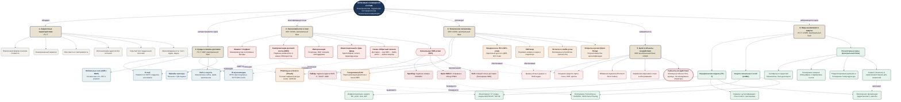

# Онтология фейковых сообщений и спама

```mermaid
%%{init: {
  'theme': 'base',
  'flowchart': {
    'curve': 'basis',
    'nodeSpacing': 35,
    'rankSpacing': 55,
    'padding': 12
  },
  'themeVariables': {
    'background': '#faf8f5',
    'primaryColor': '#ece6da',
    'primaryTextColor': '#1f2421',
    'primaryBorderColor': '#5c6b73',
    'lineColor': '#6c757d',
    'fontFamily': 'Georgia, serif',
    'fontSize': '14px'
  }
}}%%

flowchart TD
    classDef rootStyle fill:#1d3557,stroke:#102138,stroke-width:2.5px,color:#faf8f5,rx:10,ry:10;
    classDef branchStyle fill:#e9e2d0,stroke:#4a5568,stroke-width:2px,color:#1a202c,rx:8,ry:8;
    
    classDef charStyle fill:#f4f1ea,stroke:#8d99ae,stroke-width:1.5px,color:#2b2d42,rx:6,ry:6;
    classDef chanStyle fill:#e8f0f2,stroke:#457b9d,stroke-width:1.5px,color:#1d3557,rx:6,ry:6;
    classDef attackStyle fill:#f9eae7,stroke:#9e2a2b,stroke-width:1.5px,color:#3d0c0e,rx:6,ry:6;
    classDef ss7Style fill:#f3e5e5,stroke:#7f1d1d,stroke-width:1.5px,stroke-dasharray: 4 3,color:#3d0c0e,rx:6,ry:6;
    classDef techStyle fill:#f5ebe0,stroke:#bc6c25,stroke-width:1.5px,color:#3d230a,rx:6,ry:6;
    classDef goalStyle fill:#f8edeb,stroke:#b56576,stroke-width:1.5px,color:#3b1822,rx:6,ry:6;
    classDef defStyle fill:#e8f3ee,stroke:#2d6a4f,stroke-width:1.5px,color:#1b4332,rx:6,ry:6;

    ROOT(["<b>ФЕЙКОВЫЕ СООБЩЕНИЯ И СПАМ</b><br/>Незапрошенная, поддельная или вредоносная электронная информация"]):::rootStyle

    ROOT -->|обладает| CHAR["<b>1. Сущностные характеристики</b><br/><i>ITU-T</i>"]:::branchStyle
    ROOT -->|распространяется через| CHAN["<b>2. Среды и каналы доставки</b><br/><i>ITU-T, ФБР, Центральный банк</i>"]:::branchStyle
    ROOT -->|классифицируется как| TYPES["<b>3. Таксономия атак и схем</b><br/><i>ФБР, GSMA, Центральный банк</i>"]:::branchStyle
    ROOT -->|использует| TECH["<b>4. Технические механизмы</b><br/><i>ФБР, GSMA, Центральный банк</i>"]:::branchStyle
    ROOT -->|направлено на| GOALS["<b>5. Цели и объекты воздействия</b><br/><i>ФБР, Центральный банк, GSMA</i>"]:::branchStyle
    ROOT -->|нейтрализуется через| DEF["<b>6. Меры выявления и защиты</b><br/><i>ITU-T, GSMA, Центральный банк</i>"]:::branchStyle

    CHAR --> C1("Электронная форма и низкая стоимость"):::charStyle
    CHAR --> C2("Незапрошенный характер"):::charStyle
    CHAR --> C3("Массовость и повторяемость"):::charStyle
    CHAR --> C4("Использование адресов без согласия"):::charStyle
    CHAR --> C5("Скрытый или поддельный источник"):::charStyle
    CHAR --> C6("Мультимодальность: текст, аудио, видео"):::charStyle

    CHAN --> CH_MAIL("<b>E-mail</b><br/>Уязвимости SMTP, подделка заголовков"):::chanStyle
    CHAN --> CH_MOB("<b>Мобильные сети (SMS / MMS)</b><br/>Сигнальная сеть SS7 и роуминг"):::chanStyle
    CHAN --> CH_IP("<b>IP-мультимедиа</b><br/>SPIM (мессенджеры), SPIT/VAM (VoIP)"):::chanStyle
    CHAN --> CH_WEB("<b>Веб и соцсети</b><br/>Фишинговые сайты, фейк-приложения"):::chanStyle
    CHAN --> CH_OFF("<b>Офлайн-триггеры</b><br/>Посылки с QR-кодами"):::chanStyle

    TYPES --> T_PHISH("<b>Фишинг / Спуфинг</b><br/>Маскировка под легитимные бренды"):::attackStyle
    TYPES --> T_BEC("<b>Компрометация деловой почты (BEC)</b><br/>Подмена реквизитов от имени CEO/юристов"):::attackStyle
    TYPES --> T_IMP("<b>Имперсонация</b><br/>Госорганы, ФБР, полиция, техподдержка"):::attackStyle
    TYPES --> T_INV("<b>Инвестиционный и фин. фрод</b><br/>Криптобиржи, золото, пирамиды-игры"):::attackStyle
    TYPES --> T_CB("<b>Схема «Обратный звонок»</b><br/>Доставка → код SMS → фейк-робот → звонок жертвы"):::attackStyle
    TYPES --> T_SS7{{"<b>Сигнальные SMS-атаки (SS7)</b>"}}:::attackStyle

    T_SS7 --> SS7_FAKE("<b>Faking:</b> подмена адреса SMS-C / SCCP / MAP"):::ss7Style
    T_SS7 --> SS7_SPOOF("<b>Spoofing:</b> подмена номера MSISDN"):::ss7Style
    T_SS7 --> SS7_OPEN("<b>Open SMS-C:</b> отправка в обход HPMN"):::ss7Style
    T_SS7 --> SS7_DOS("<b>DoS:</b> ложный статус доставки (блокировка SMS)"):::ss7Style

    TECH --> TC_AI("<b>Генеративный ИИ</b><br/>Персонализация диалогов и писем BEC"):::techStyle
    TECH --> TC_PHAAS("<b>Phishing-as-a-Service (PhaaS)</b><br/>Готовая инфраструктура (напр. LabHost)"):::techStyle
    TECH --> TC_MAL("<b>Вредоносное ПО и NFC-атаки</b><br/>Удалённый доступ к ДБО, NFC Gate"):::techStyle
    TECH --> TC_SIM("<b>SIM Swap</b><br/>Перехват номера и кодов у оператора"):::techStyle
    TECH --> TC_BOT("<b>Ботнеты и зомби-узлы</b><br/>Взломанные устройства третьих лиц"):::techStyle
    TECH --> TC_REL("<b>Открытые релеи (Open Relay)</b><br/>Ретрансляция без аутентификации"):::techStyle

    GOALS --> G_DATA("Кража учётных данных и SMS-кодов"):::goalStyle
    GOALS --> G_FIN("Хищение средств: карты, счета, СБП, крипта"):::goalStyle
    GOALS --> G_SUB("Обманная подписка (Premium Short Codes)"):::goalStyle
    GOALS --> G_INF("Заражение вирусами и отказ в обслуживании"):::goalStyle
    GOALS --> G_VIC(["<b>Субъекты воздействия:</b><br/>Физлица (особенно 60+), юрлица, топ-менеджмент, операторы"]):::goalStyle

    DEF --> D_ITU("<b>Иерархическая модель (ITU-T)</b>"):::defStyle
    D_ITU --> D_INFRA("<i>Инфраструктура:</i> защита ОС, роли, логи, МЭ"):::defStyle
    D_ITU --> D_SERV("<i>Сервисы:</i> аутентификация, Flow Control, трассировка"):::defStyle
    D_ITU --> D_APP("<i>Приложения:</i> фильтрация (адрес/контент), жалобы"):::defStyle

    DEF --> D_GSMA("<b>Защита сигнальных сетей (GSMA)</b>"):::defStyle
    D_GSMA --> G_MON("<i>Мониторинг:</i> C7-зонды, сверка MAP/SCCP, TAP-IN"):::defStyle
    D_GSMA --> G_PREV("<i>Блокировка:</i> Screening на HLR/MSC, SMS Home Routing"):::defStyle

    DEF --> D_REG("<b>Регуляторные меры (Центральный банк)</b>"):::defStyle
    D_REG --> R_ANTI("Антифрод по кредитам/банкоматам, база дропперов"):::defStyle
    D_REG --> R_TEL("Блокировка номеров (Минцифры) и маркировка счетов"):::defStyle
    D_REG --> R_WEB("Разделегирование доменов и блокировки Генпрокуратуры"):::defStyle
    D_REG --> R_UX("Сервис («кнопка») в приложениях банков для заявлений"):::defStyle

    T_PHISH -.->|использует| TC_PHAAS
    T_PHISH -.->|ведёт на| CH_WEB
    T_BEC -.->|усиливается| TC_AI
    T_BEC -.->|использует| CH_MAIL
    T_CB -.->|использует| CH_IP
    T_CB -.->|перехватывает| G_DATA
    SS7_FAKE -.->|выявляется| G_MON
    SS7_FAKE -.->|блокируется| G_PREV
    SS7_OPEN -.->|блокируется| G_PREV
    TC_MAL -.->|обеспечивает| G_FIN
    TC_SIM -.->|обеспечивает| G_DATA
    R_UX -.->|наполняет| D_APP
```
